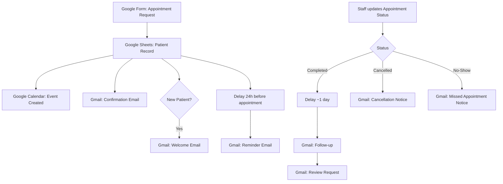

# 🦷 Zapier Dental Automation

**No-code automation that runs a dental clinic's appointment lifecycle end-to-end — from patient inquiry to post-visit review request — built entirely on Zapier.**

[](https://zapier.com) [](#) [](LICENSE)

---

## 1. Project Description

This project is a real, working no-code backend for a dental clinic that eliminates manual appointment admin. A patient fills out a simple online form, and everything downstream — record-keeping, calendar scheduling, confirmation, reminders, personalized welcome messaging, and post-visit follow-up — happens automatically, driven by appointment status changes a staff member makes in a spreadsheet.

It was designed, built, and tested step-by-step (every trigger and action verified in Zapier's test runner) rather than left as a diagram-only concept.

---

## 2. Problem Statement

Small dental practices typically manage bookings manually: a receptionist notes down appointments, sends reminders by hand (or not at all), and has no consistent process for following up after a visit or asking for a review. This leads to:

- Missed or inconsistent appointment reminders → higher no-show rates
- No structured welcome flow for new patients
- Follow-up and review requests forgotten after busy days
- No single source of truth for appointment status

---

## 3. Business Use Case

A solo or small-team dental clinic wants professional, consistent patient communication without hiring extra front-desk staff or buying an expensive practice-management suite. This automation gives them that — using tools they likely already have (Google Workspace + email) plus a Zapier account.

**Who this is for:** independent dental clinics, small multi-chair practices, or any appointment-based healthcare service evaluating whether no-code automation can replace parts of a manual front-desk workflow.

---

## 4. Automation Workflow

```
Trigger
   ↓
New Appointment Request (Google Form)
   ↓
Store Patient & Appointment Info (Google Sheets)
   ↓
Create Calendar Event + Send Confirmation Email
   ↓
Branch: New Patient? → Send Welcome Email
   ↓
Delay Until 24h Before Appointment → Send Reminder Email
   ↓
Staff Updates Appointment Status (Confirmed / Completed / Cancelled / No-Show)
   ↓
Status-Based Branch:
   • Completed  → Delay ~1 day → Follow-up Email → Review Request Email
   • Cancelled  → Cancellation Notice
   • No-Show    → Missed-Appointment Notice
   ↓
Update Status Columns in Google Sheets
```

Full breakdown: [`docs/workflow.md`](docs/workflow.md) · Zap-by-zap configuration: [`automation/zap-configuration.md`](automation/zap-configuration.md)

---

## 5. Tools & Technologies

| Tool | Role |
|---|---|
| **Zapier** | Automation/orchestration platform (primary) |
| **Google Forms** | Patient-facing appointment intake |
| **Google Sheets** | System-of-record for patient + appointment data |
| **Google Calendar** | Internal appointment scheduling |
| **Gmail** | All automated patient communication |
| Filter by Zapier | Conditional branching (patient type, appointment status) |
| Formatter by Zapier | Date/time parsing for reminder scheduling |
| Delay by Zapier | 24h pre-appointment delay, ~1 day post-visit delay |

No integration is listed here that wasn't actually built and tested.

---

## 6. Step-by-Step Workflow

| Step | Action |
|---|---|
| 1 | Patient submits the appointment request form |
| 2 | A new row is created in the Google Sheet patient database |
| 3 | A Google Calendar event is created (title only — no sensitive data) |
| 4 | A confirmation email is sent; new patients also get a welcome email |
| 5 | 24 hours before the appointment, a reminder email is sent automatically |
| 6 | Clinic staff updates the **Appointment Status** column once the visit happens (or doesn't) |
| 7 | Zapier detects the status change and branches: Completed → follow-up + review request · Cancelled → cancellation notice · No-Show → missed-appointment notice |
| 8 | Every automated email also updates its corresponding status column, so the sheet always reflects reality |

---

## 7. Trigger & Actions Summary

| Zap | Trigger | Core Actions |
|---|---|---|
| New Appointment Confirmation & Calendar | Google Forms – New Form Response | Create Sheet Row → Create Calendar Event → Send Email |
| New Patient Welcome Email | Google Forms – New Form Response | Filter (Patient Type) → Send Email |
| 24-Hour Appointment Reminder | Google Forms – New Form Response | Formatter → Delay Until → Send Email → Update Sheet Row |
| Appointment Completed – Follow-up & Review Request | Google Sheets – Updated Row (column: Appointment Status) | Filter → Delay → Send Email → Update Sheet Row → Send Email |
| Appointment Cancelled – Notification | Google Sheets – Updated Row (column: Appointment Status) | Filter → Send Email |
| Appointment No-Show – Notification | Google Sheets – Updated Row (column: Appointment Status) | Filter → Send Email |

Full field-level detail: [`automation/zap-configuration.md`](automation/zap-configuration.md)

---

## 8. Data / Field Mapping

| Form Field | Sheet Column | Used By |
|---|---|---|
| Patient Name | Patient Name | Calendar event title, all emails |
| Email | Email | Recipient for every automated email |
| Phone | Phone | Stored for staff reference |
| Patient Type | Patient Type | Drives the New Patient welcome-email filter |
| Preferred Date | Appointment Date | Reminder delay calculation, calendar event |
| Preferred Time | Appointment Time | Reminder delay calculation, calendar event |
| Reason for Visit | Reason for Visit | Internal reference only (never in calendar event) |
| *(staff-set)* | Appointment Status | Drives Completed/Cancelled/No-Show branching |
| *(automated)* | Reminder Status | Set after the 24h reminder sends |
| *(automated)* | Follow-up Status | Set after the post-visit follow-up sends |
| *(automated)* | Review Request Status | Set after the review-request email sends |

Full mapping detail: [`automation/field-mapping.md`](automation/field-mapping.md)

---

## 9. Expected Business Benefits

- **Fewer no-shows** — automatic 24h reminders instead of relying on staff memory
- **Consistent patient experience** — every patient gets the same confirmation/welcome/follow-up flow, regardless of how busy the front desk is
- **Time saved** — no manual reminder calls, follow-up emails, or review-request outreach
- **Always-current records** — the sheet's status columns update themselves instead of drifting out of sync
- **Zero extra software cost** — built entirely on tools most small clinics already use (Google Workspace) plus a single Zapier subscription

---

## 10. Example Use Case

> Sarah, a new patient, submits the appointment form for a routine check-up. Within seconds she receives a confirmation email and a separate welcome email. The clinic's calendar shows "Dental Appointment - Sarah Miller" for that slot. 24 hours before her visit, she gets an automatic reminder. After her appointment, the front desk marks her status "Completed" in the sheet — a day later, Sarah automatically receives a thank-you follow-up, then a request to leave a Google review.
>
> See a full sample payload in [`examples/sample-appointment-request.json`](examples/sample-appointment-request.json) and a sample email in [`examples/sample-email.md`](examples/sample-email.md).

---

## 11. Setup / Configuration Instructions

Full guide: **[`docs/setup.md`](docs/setup.md)**

Quick overview: create the Google Form + Sheet → connect Google Forms/Sheets/Calendar/Gmail in Zapier via OAuth → build the 6 Zaps as documented in `automation/zap-configuration.md` → test every step with fake data → go live.

---

## 12. Screenshots

> **Screenshot placeholders** — real screenshots of the live Zapier dashboard were shown during development but aren't yet committed to this repo. Drop them into [`assets/screenshots/`](assets/screenshots/) using the filenames below; the links here will then render automatically.

- `assets/screenshots/zaps-list.png` — all 6 published Zaps
- `assets/screenshots/zap-detail-example.png` — one Zap opened, showing its steps

---

## 13. Workflow Diagram



(A static image version can be added at `assets/workflow-diagram.png` if preferred — this Mermaid diagram renders natively on GitHub in the meantime.)

---

## 14. Security & Privacy Considerations

- **No real patient data, API keys, passwords, OAuth tokens, or Zapier webhook secrets are stored in this repository.** All example data uses fictional names (see `examples/` and `.gitignore`).
- Google Calendar events contain only the patient's name — no phone number, email, or reason for visit.
- All app connections (Google, Gmail) are made via OAuth sign-in directly inside Zapier — never by pasting credentials into code or config.
- `.gitignore` explicitly blocks `.env` files, key/token files, and any accidental real-patient-data files from being committed.

---

## 15. Future Improvements

- [ ] Optional SMS/WhatsApp reminders via Twilio
- [ ] No-show rate dashboard (Google Sheets → Looker Studio)
- [ ] Two-way calendar sync (patient reschedule → auto-update sheet)
- [ ] Migrate orchestration to n8n for finer-grained error handling
- [ ] Automated review-request link personalization per clinic location

---

## 16. Portfolio / Project Highlights

- Designed and implemented a **6-workflow automation system**, not a single linear Zap — each mapped to a distinct business event (booking, new-patient welcome, reminder, completed, cancelled, no-show)
- Made a deliberate **architecture decision** (filter-gated independent Zaps over native Zapier Paths) and documented the reasoning — see [`docs/workflow.md`](docs/workflow.md)
- Used **scoped trigger columns** on Google Sheets to avoid redundant automation runs — a detail that matters for task-quota efficiency in production
- Fully **tested step-by-step** before publishing, using safe fictional data throughout
- Documented to a standard a non-technical clinic owner *and* a technical reviewer can both follow

---

## 17. Repository Structure

```text
zapier-dental-automation/
├── README.md
├── LICENSE
├── .gitignore
├── docs/
│   ├── workflow.md
│   ├── setup.md
│   └── business-use-case.md
├── automation/
│   ├── workflow-overview.md
│   ├── zap-configuration.md
│   └── field-mapping.md
├── assets/
│   └── screenshots/          (add real screenshots here)
└── examples/
    ├── sample-appointment-request.json
    └── sample-email.md
```

---

## License

MIT — see [`LICENSE`](LICENSE)

## Author

**Mansi Rai** — AI/automation engineering practice (Python, LangChain, n8n, Zapier). This project demonstrates real-world no-code workflow design: conditional branching, delayed actions, and status-driven automation without custom code.
